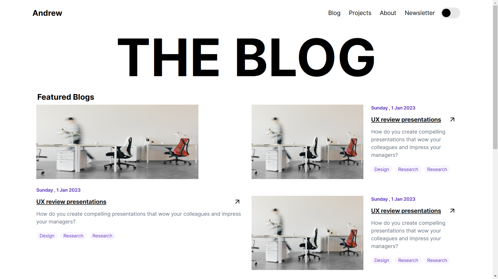

# Blog App- A blogging application

This is a simple blogging application design in Next Js usig very simple css and there is no backend functionality whatsover.

## Table of contents

- [Overview](#overview)
  - [Screenshot](#screenshot)
  - [Links](#links)
- [My process](#my-process)
  - [Built with](#built-with)
  - [What I learned](#what-i-learned)
  - [Continued development](#continued-development)
  - [Useful resources](#useful-resources)
- [Author](#author)

## Overview

This application is build using the Next Js framework and the design ui is from figma.
I built it merely as a test application to see and learn how to use Next Js the react framework.
I learnt the pitfalls of bad project structure and not arranging my css classes well.
I also saw the advantages of using tailwind as a css framework since it you get to work on the css and see the changes immediately.
Using BEM and react is hard since of the component structure of react.
For example once you already give a specific component its class name then break away from its parent which has another class name it becomes hard to style the elements as the classes are separate.
But I do feel that SASS can come to the rescue in such a situation.

### Screenshot

### Links

- Solution URL: [Blog App](https://blog-app-five-sable.vercel.app/)
- Live Site URL: [Blog App](https://blog-app-five-sable.vercel.app/)

## My process

### Built with

- Semantic HTML5 markup
- CSS custom properties
- Flexbox
- CSS Grid
- Mobile-first workflow
- [React](https://reactjs.org/) - JS library
- [Next.js](https://nextjs.org/) - React framework

### What I learned

I learnt on using CSS BEM methodology for naming my classes.
I also learnt on using next js better.
I also learnt on how to add light and dark themes in css.

### Continued development

I would still like to know how to use next js better.
I also need to improve on how i arrange my project structure.

### Useful resources

- [Next JS](https://nextjs.org/docs) - This helped me for XYZ reason. I really liked this pattern and will use it going forward.

## Author

- Website - [Andrew Kimani](https://www.andrewkimani.tech/)
- Twitter - [@andrew_kim2003](https://x.com/andrew_kim2003)

